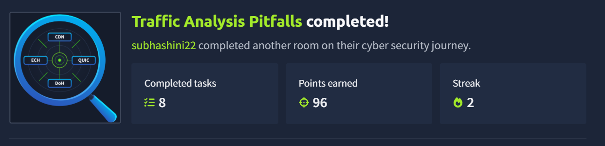
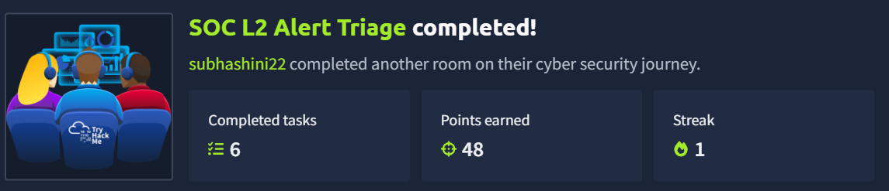
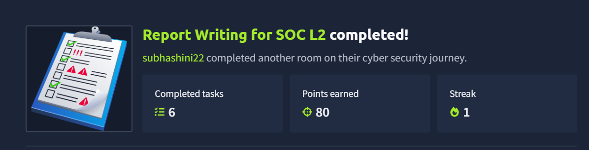
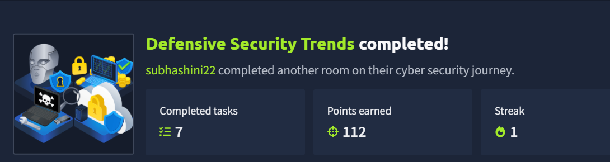
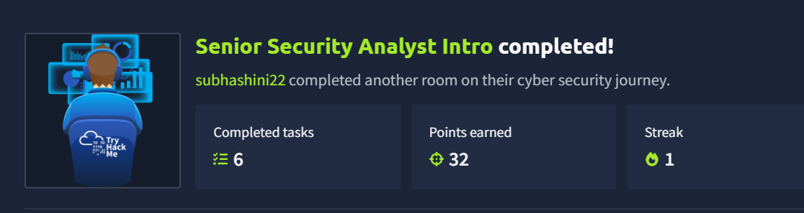
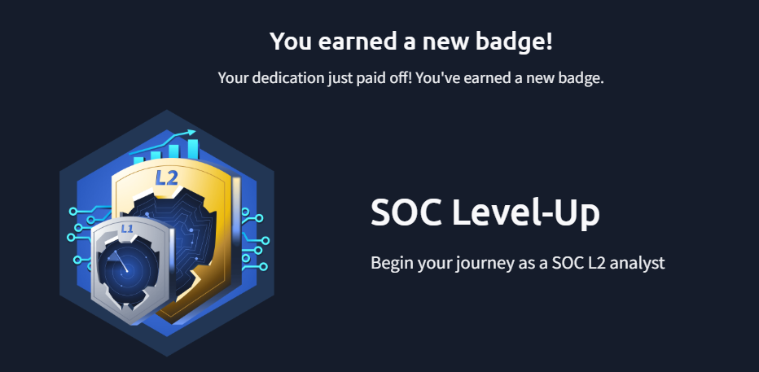

# SOC Learning – TryHackMe

This folder documents my hands-on cybersecurity and SOC learning completed through TryHackMe.

## Completed Modules

### 1. Traffic Analysis Pitfalls

Completed practical exercises focused on traffic analysis and identifying common challenges during security investigations.

---

### 2. SOC L2 Alert Triage

Practiced reviewing security alerts, analyzing L1 investigation notes, investigating relevant logs, and determining the appropriate next steps for escalation and response.

---

### 3. Report Writing for SOC L2

Practiced documenting security incidents and communicating investigation findings clearly for both technical and management audiences.

---

### 4. Defensive Security Trends

Explored current cybersecurity trends and their impact on Security Operations Centers, including AI-assisted security operations, supply-chain attacks, infostealers, RMM abuse, and Initial Access Brokers.

---

### 5. Senior Security Analyst Intro

Practiced concepts related to senior SOC responsibilities, including alert investigation, escalation, log analysis, incident response, threat hunting, detection improvement, and lessons learned.

---

## SOC Investigation Workflow

The exercises helped me understand a structured SOC investigation workflow:

1. Receive or escalate an alert
2. Review the alert and detection logic
3. Review previous analyst investigation
4. Investigate relevant logs
5. Verify suspicious activity
6. Determine the appropriate response
7. Resolve and document the incident
8. Identify lessons learned
9. Improve detection and prevention

## Key Takeaways

- Improved understanding of SOC alert triage and escalation
- Practiced log and traffic analysis
- Learned the importance of detection coverage
- Practiced incident response decision-making
- Improved security incident reporting
- Explored emerging cybersecurity trends
- Developed a better understanding of L2 and senior SOC responsibilities

## SOC Level-Up

## Platform

[TryHackMe](https://tryhackme.com/)
